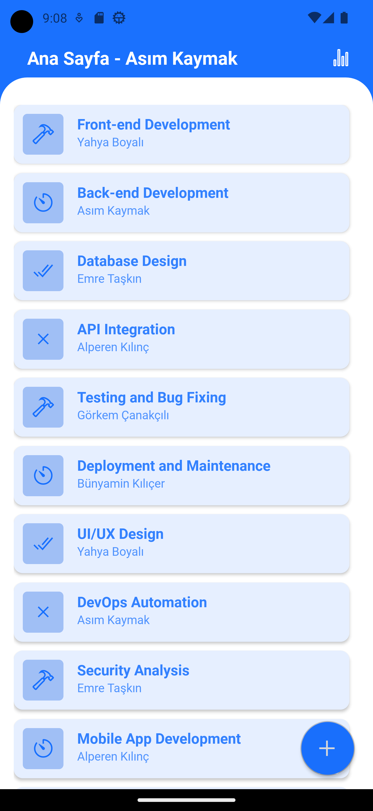

# JOB RATING APP

## About

Work made through a mobile application, or a mobile application software that can give positive negative feedback to persons. Performance reporting through a dasboard of scores received from feedbacks.

## Installation

Before installation steps you need
- Node.js v18.15.0
- npm v9.5.0
- Python v3.9.6

```bash
pip install -r requirements.txt
npm -i
```

## Usage

- Firstly, run the backend

    ```bask
    flask run
    ```

- Then, you can build and run the application

    ```bask
    npx expo start
    ```

## Screenshots

- Login

    

- Login Error

    

- Register

    

- Home

    

- Job Detail

    

- Empty Job Detail

    